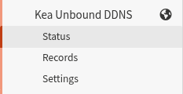

# os-kea-unbound (DDNS edition)

**OPNsense plugin: automatically register dynamic Kea DHCP leases in Unbound DNS — forward and reverse, with no core-file patching.**

When a device picks up a DHCP lease, its hostname starts resolving in Unbound within
moments (A/AAAA **and** PTR) and keeps resolving across Unbound restarts and reboots,
for as long as the lease is valid.

<p align="center">
  <br>
  <sub><i>Services → Kea Unbound DDNS</i></sub>
</p>
<p align="center">
  <br>
  <sub><i>Status page — up and running</i></sub>
</p>

> This is the rewritten `0.x` line. It replaces the old **v3.x** plugin — which
> patched OPNsense's Kea files at install time — with a clean plugin built on Kea's
> *native* Dynamic DNS. Nothing in core is touched, so OPNsense upgrades can't break
> it and uninstall is trivially clean. See **[How it works](docs/HOW-IT-WORKS.md)**.

## Features

- **Automatic** — dynamic leases are registered on grant/renew and removed on
  release/expiry, forward (A/AAAA) and reverse (PTR).
- **Global by default, per-VLAN when you want it** — zero per-subnet setup out of the
  box; optionally give each subnet its own domain so leases resolve under their VLAN's
  zone (see *[Per-VLAN domains](#per-vlan-domains)*).
- **Leaves your static DNS alone** — DHCP reservations and Host Overrides stay
  OPNsense's; the plugin never adds, deletes, or prunes them.
- **Survives restarts** — records persist across Unbound restarts and reboots, no
  repopulation wait.
- **Secure by default** — TSIG-authenticated; the listener rejects unsigned,
  wrong-key, and wrong-algorithm updates.
- **Clean uninstall** — nothing in core is patched, so there is nothing to undo.

## Requirements

- OPNsense 26.1+ (Kea is the DHCP server)
- Kea DHCPv4 and/or DHCPv6 enabled, with Unbound as the resolver
- `py313-dnspython` (installed automatically by `pkg`)

## Install

```sh
pkg add https://github.com/JameZUK/os-kea-unbound/releases/download/v0.14.0/os-kea-unbound-0.14.0.pkg
```

(Or [build it from source](docs/HOW-IT-WORKS.md#build-from-source).)

## Migrating from the old v3.x plugin

The old v3.x plugin and this one share the package name `os-kea-unbound`, but they're
different plugins — v3.x patched core Kea files; this one uses Kea's native DDNS. **Don't
upgrade in place; remove the old one cleanly first, then install this.**

1. **Detach the old plugin:** Services → Kea DHCP → **Kea DHCPv4** *and* **Kea DHCPv6**
   → Settings → untick **Register Leases in Unbound (via os-kea-unbound)** → **Save**.
   (This removes its hooks from Kea's config.)
2. **Remove it:** `pkg delete os-kea-unbound` — this undoes the old plugin's core-file
   patches and scrubs its Kea hook entry.
3. **Restart Kea** (Services → Kea DHCP → restart DHCPv4/DHCPv6) so Kea runs cleanly.
4. **Install this version** (see *Install* above), then **enable** it at its new home:
   Services → **Kea Unbound DDNS** → Settings.

> The version number goes *down* (3.8.x → 0.x), so a normal package "upgrade" won't
> offer it — the delete-then-install above is the supported path. Your DHCP reservations
> and Host Overrides are untouched throughout; dynamic records repopulate automatically
> once you enable this plugin.

## Configure

**Services → Kea Unbound DDNS → Settings**, tick **Enable**, click **Save**. That's
it — the plugin wires up Kea's DDNS, generates a TSIG key, and seeds existing leases.


| Setting | Default | Notes |
|---|---|---|
| Enable | off | Master switch. |
| Qualifying suffix | *(firewall domain)* | The forward zone; blank uses the system domain. |
| Aggressive cleanup | on | Drop a host's old address when it moves to a new one. |
| Update on renew † | on | Refresh DNS on renewals, not just first grant. |
| TSIG authentication | on | Sign updates with an auto-generated key (unsigned/wrong-key are rejected). |
| TSIG algorithm † | hmac-sha256 | `hmac-sha256`, `-sha512`, or `-sha1`. |
| Listener port † | 53535 | Loopback only. |

† Shown only under **advanced mode** (toggle at the top of the form). The defaults are fine for almost everyone.

### Per-VLAN domains

By default every dynamic lease is qualified with a single suffix (the **Qualifying
suffix** above, or the firewall's system domain). If you run multiple VLANs and want
each to register under its **own** domain, just set a per-subnet **Domain name** — the
plugin picks it up automatically:

**Services → Kea DHCP → KEA DHCPv4 (or DHCPv6) → Subnets → (edit a subnet)**

1. Untick **Automatically collect option data** — otherwise OPNsense overwrites the
   domain with the firewall's system domain, so every VLAN looks the same.
2. Set **Domain name** to that VLAN's domain, e.g. `iot.lan`.
3. **Save**, then apply.

Leases on that subnet now resolve under its own domain (e.g. `camera.iot.lan`), forward
and reverse. Subnets you don't touch keep using the global suffix, so this is fully
opt-in. Behind the scenes the plugin gives each subnet its own Kea
`ddns-qualifying-suffix` and registers a DDNS forward zone per distinct domain, so every
suffix is routed to the listener correctly.

## Status & Records

**Status** shows listener health, the registered record count, TSIG state, the
effective qualifying suffix, a **Sync now** button, a **Remove stale records** button,
and a live activity log.

**Remove stale records** prunes any records Unbound still holds that Kea no longer knows
about (an expired or released lease, or a host that moved to another VLAN). It applies
the removals to the running Unbound straight away, so there's no need to stop the plugin
or restart Unbound. It's safe in an HA setup: if it can't confirm a current lease list
from Kea it does nothing rather than risk removing good records, and it refuses to bulk
remove an unusually large number at once.

**Records** lists every registered record, enriched with the matching Kea lease detail
(hostname, MAC/DUID, subnet, source, expiry, TTL) — searchable and sortable.


### CLI

```sh
configctl keaunbound status      # listener state
configctl keaunbound sync        # re-seed existing leases
configctl keaunbound clean       # prune records Kea no longer knows about
configctl keaunbound records     # list registered records (JSON)
configctl keaunbound log 500     # tail the activity log
```

## Uninstall

Untick **Enable → Save** (reverts everything cleanly), or `pkg delete os-kea-unbound`.
Because nothing in core was patched, there is nothing else to undo.

## Documentation

- **[How it works](docs/HOW-IT-WORKS.md)** — architecture, what it manages and leaves
  alone, why it replaces v3.x, the Unbound "manual overwrites" notice, and building
  from source.
- **[Testing](docs/TESTING.md)** — the unit and live integration suites, and the
  production test pass.
- **[PLAN.md](PLAN.md)** — full design notes and history.

## License

BSD-2-Clause.
