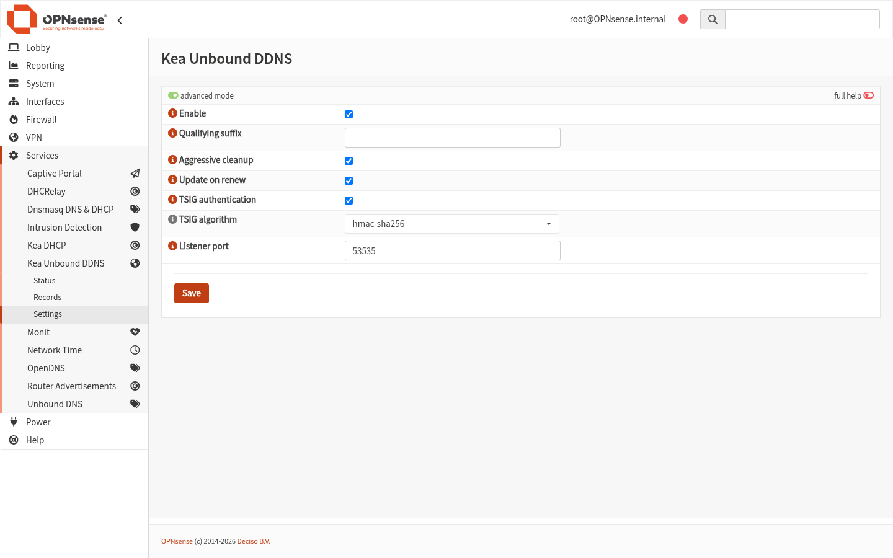
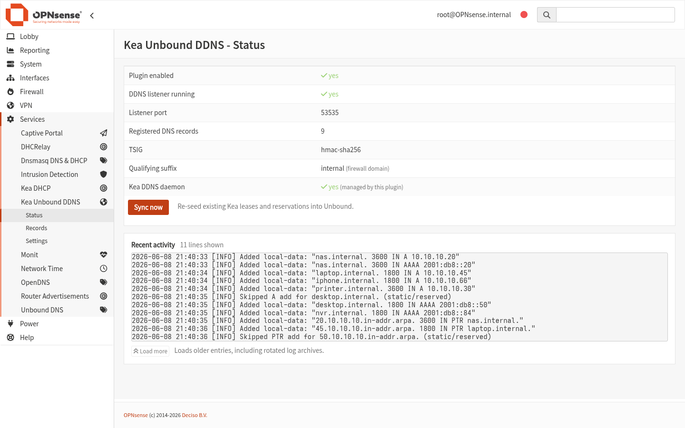
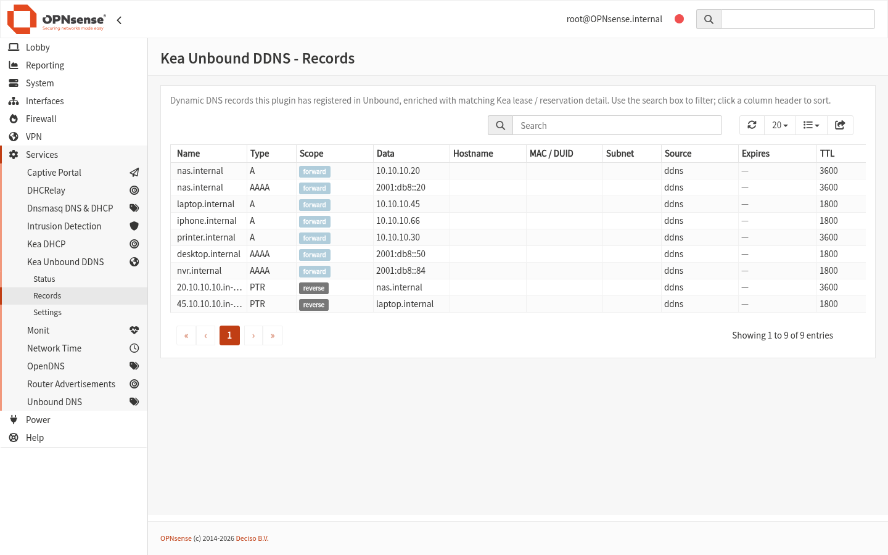

# os-kea-unbound (DDNS edition, 0.x)

**OPNsense plugin: register dynamic Kea DHCP leases in Unbound DNS — automatically, with no core-file patching.**

> This is the rewritten `0.x` line. It replaces the v3.x approach (which patched
> Kea's MVC/PHP files at install time) with a clean standalone plugin that uses
> Kea's *native* Dynamic DNS. See `PLAN.md` for the full design and history.

When a DHCP client gets a dynamic lease, its hostname resolves in Unbound within
moments — forward (A/AAAA) and reverse (PTR) — and stays resolvable across Unbound
restarts and reboots, for as long as the lease is valid.

## How it works

```
 kea-dhcp4/6 ─── leases ───► kea-dhcp-ddns (D2) ── RFC 2136 (TSIG) ──► kea-unbound-ddns
      │                                                                  (127.0.0.1:53535)
      │ existing leases (control socket)                                       │
      └──────────────────────────► lease-sync ─────────────────────────► unbound-control
                                                                                │
                                                          /usr/local/etc/unbound.opnsense.d/
                                                                  keaunbound.conf
                                                            (persists across restarts)
```

- **Real-time path:** Kea's built-in `kea-dhcp-ddns` (D2) sends TSIG-signed RFC 2136
  updates to a loopback listener, which writes them to Unbound the instant a lease
  is granted, renewed, or released.
- **Initial/seed path:** existing leases (read from the Kea control socket) are
  seeded on enable/start so nothing waits for a renewal.
- **Persistence:** every record is mirrored into
  `/usr/local/etc/unbound.opnsense.d/keaunbound.conf`, which OPNsense's generated
  `unbound.conf` always `include:`s — so records survive Unbound restarts and reboots
  with no repopulation, as long as the lease is still within its window.

## Why this is better than the old (v3.x) plugin

The previous plugin worked by **patching OPNsense's core Kea files** (its models,
PHP and templates) at install time to bolt DDNS onto the GUI. That approach was
fragile in ways this rewrite eliminates:

| | Old v3.x (core-file patching) | This 0.x (native DDNS) |
|---|---|---|
| **OPNsense upgrades** | A core update overwrites the patched files and silently breaks DDNS — or worse, leaves damaged files behind (we found 6 such files on a production box, which broke the unrelated Kea *Options* tab). | Nothing in core is touched, so upgrades can't break it. |
| **Uninstall** | Leaves patched/edited core files behind; never truly clean. | Trivially clean — there is nothing in core to undo. |
| **Per-subnet setup** | Manual DDNS wiring, often per subnet. | Zero setup — DDNS is configured globally and automatically. |
| **DNS update transport** | Bespoke. | Kea's *own* `kea-dhcp-ddns` (D2) over standard RFC 2136 + TSIG. |
| **Static entries** | Easy to clobber. | Reservations and Host Overrides are never touched (see below). |
| **Security** | — | TSIG on by default; the listener rejects unsigned and wrong-key updates. |

In short: same outcome (dynamic leases resolve in Unbound, forward and reverse),
but built on Kea's supported DDNS plumbing instead of monkey-patching the firewall.

## What it manages (and what it leaves alone)

This plugin registers **dynamic (non-reserved) leases only** — both forward
(A/AAAA) and reverse (PTR) — and is careful never to touch anything OPNsense already
manages:

- **Dynamic leases →** registered and kept current (added on grant/renew, removed on
  release/expiry, old address dropped when a host moves).
- **DHCP reservations and Host Overrides →** left entirely to OPNsense, which already
  writes them into Unbound's `host_entries.conf`. The listener and the cleanup pass
  both guard these: a DDNS update for a reserved address is skipped, and stale-record
  pruning will never remove a static or reserved record. This division of labour is
  what keeps internal DNS resolving even while dynamic records churn.

## What makes it different

- **No core-file patching.** Nothing edits Kea's models/PHP/templates, so OPNsense
  upgrades can't break it and uninstall is trivially clean.
- **Zero per-subnet setup.** DDNS is configured *globally and automatically* — you
  don't touch each subnet (the usual Kea-DDNS chore).
- **Auto-provisioned TSIG.** An HMAC-SHA256 key is generated once and wired into both
  Kea D2 and the listener; on by default. Unsigned/wrong-key updates are rejected.
- **Config-safe.** The only persistent Kea setting it changes is enabling the DDNS
  daemon, and only if you didn't already have it on — recorded and reverted on
  disable/uninstall. It never overwrites an existing user DDNS config (it adds a
  catch-all alongside). All edits are atomic; changes are logged + announced.

## Requirements

- OPNsense 26.1+ (Kea is the DHCP server; ISC dhcpd is gone)
- Kea DHCPv4 and/or DHCPv6 enabled, Unbound the active resolver
- `py313-dnspython` (declared in `PLUGIN_DEPENDS`, installed by `pkg`)

## Install

Build from the OPNsense plugins tree on an OPNsense/FreeBSD host:

```sh
git clone https://github.com/opnsense/plugins /usr/plugins
git clone https://github.com/JameZUK/os-kea-unbound /usr/plugins/dns/kea-unbound
cd /usr/plugins/dns/kea-unbound
make package          # -> work/pkg/os-kea-unbound-0.x.pkg
pkg add work/pkg/os-kea-unbound-*.pkg
```

## Configuration

**Services → Kea Unbound DDNS → Settings**, tick **Enable**, Save. That's it — the
plugin enables Kea's DDNS daemon, points it at the listener, generates the TSIG key,
and seeds existing leases.



| Setting | Default | Notes |
|---|---|---|
| Enable | off | Master switch; on enable it wires up D2 + the listener and seeds leases. |
| Qualifying suffix | *(firewall domain)* | The forward zone. Blank falls back to the system domain. |
| Aggressive cleanup | on | Drop a host's old address when it moves to a new one. |
| Update on renew | on | Refresh DNS on lease renewals, not just first grant. |
| TSIG authentication | on | HMAC-SHA256 with an auto-generated key. |
| TSIG algorithm | hmac-sha256 | |
| Listener port | 53535 | Loopback only. |

## Status & Records

**Services → Kea Unbound DDNS → Status** shows listener health, the registered
record count, TSIG state, the effective qualifying suffix, whether the plugin manages
Kea's DDNS daemon, a **Sync now** button, and a live **Recent activity** log with a
**Load more** button that pages back through the rotated archives.



**Services → Kea Unbound DDNS → Records** lists every DNS record the plugin has
registered, enriched with the matching Kea lease/reservation detail (hostname,
MAC/DUID, subnet, source, expiry, TTL). It's searchable, sortable and filterable.



### CLI (configd)

```sh
configctl keaunbound status      # listener state
configctl keaunbound sync        # re-seed existing leases
configctl keaunbound audit       # report drift vs Kea (read-only, JSON)
configctl keaunbound clean       # prune stale records Kea no longer knows
configctl keaunbound records     # list registered records as JSON
configctl keaunbound log 500     # tail N activity-log lines (spans archives)
```

- A daily housekeeping task (`/etc/periodic/daily/500.keaunbound-clean`) prunes stale
  records; it has an anomaly guard so a transient/empty Kea response can never trigger
  a mass deletion.
- Logs: `/var/log/keaunbound/keaunbound.log` (rotated by newsyslog, 1 MB × 10).

## Testing

This plugin was tested well beyond unit level — including a full migration onto a
live production network with real DHCP clients, which surfaced (and fixed) several
bugs only visible under real traffic.

- **Unit tests (29)** — `tests/unit/`, covering the record logic and static/reserved
  guards (`test_records.py`), dynamic-lease derivation (`test_kea_source.py`), the Kea
  config injection incl. the `dhcp-ddns` block (`test_config_sync.py`), and Unbound
  I/O batching (`test_unbound_io.py`).
- **Live integration suite** — `tests/integration/`, run against a real OPNsense box
  with Kea + Unbound. End-to-end scenarios (A1–A18, plus daemon-respawn and
  Unbound-restart checks):
  - **A1–A3** forward A/AAAA add and reverse PTR add
  - **A4–A5** dual-stack moves: removing the A leaves the AAAA intact, and vice-versa
  - **A6** aggressive cleanup: old IP dropped, new IP present when a host moves
  - **A7** TSIG enforcement: unsigned and wrong-key updates are rejected
  - **A8** static guard: a DDNS update for a reserved address is *not* applied and
    *not* written to our file
  - **A12** family-safe ANY-deletes: a forward name-wide delete keeps both A and AAAA;
    a specific A delete keeps the AAAA
  - **A13** reverse ANY-delete removes the PTR
  - **A14** reserved A + PTR survive a DDNS delete, while non-reserved records remain
    removable
  - **A15** lease add registers A + PTR; lease release removes both
  - **A16** multiple RRsets across hosts and families
  - **A17** v6→v4 ordering: removing the AAAA preserves the A
  - **A18** a reserved host is *never* registered by the plugin, while a dynamic host is
  - **H** the listener is respawned by its supervisor (new live PID) if it dies
  - **J** records persist across an Unbound restart

The tests run via a small standalone shim (no pytest needed on the box); see
`PLAN.md` for the harness and the production test pass.

## A note on the Unbound "manual overwrites" notice

After enabling, the Unbound settings page shows: *"The configuration contains
manual overwrites, these may interfere with the settings configured here."* This is
**expected and benign.** The plugin persists its records in
`/usr/local/etc/unbound.opnsense.d/keaunbound.conf` — OPNsense's documented
custom-include source dir, which is the only way records survive an Unbound
restart. OPNsense flags any custom include there with that generic notice. Our
file only *adds* `local-data:` records; it does not change any Unbound setting, so
nothing actually interferes. The notice clears if you disable/uninstall the plugin.

## Uninstall

Disabling the plugin (Settings → untick Enable → Save) fully reverts everything:
stops the listener, reverts Kea's DDNS daemon if the plugin enabled it, flushes the
plugin's records, and regenerates a clean Kea config. `pkg delete` does the same via
a pre-deinstall safety net. Because nothing in core was patched, there is nothing
else to undo.

## License

BSD-2-Clause.
